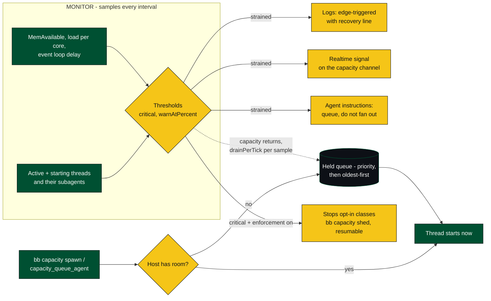

# bb-plugin-capacity

Admission control and overload warnings for the host a bb server runs on.

## How it works



## Why it exists

Each agent thread on a bb host is a provider bridge worker plus a provider
command-line process. On a small machine a handful of them at once exhausts
memory and starves the bb server's event loop: the interface goes slow or
unresponsive, threads drop into `error`, and nothing in bb attributes any of it
to the number of agents that were running.

bb already limits workflow fan-out (`bb plugin config workflows`), but that
limit only covers agents a workflow starts. Threads started from the interface,
from `bb thread spawn`, from automations, and from other plugins are counted by
nothing.

This plugin counts them all against one limit, holds new work in a queue when
the host cannot take it, and warns through channels an operator and an agent
both read.

## What it measures

Every sample interval it records:

- threads whose runtime is `active` or `starting`, plus the subagents those
  threads report running underneath themselves;
- available memory, read from `MemAvailable` on Linux so reclaimable page cache
  does not read as exhaustion;
- one-minute load average divided by the processor count;
- the bb server's own event loop delay — the stall an operator actually feels.

Each of those has a critical threshold. `warnAtPercent` places a warning
threshold proportionally before each one, so a single setting tunes how early
every signal speaks up.

## The queue

`bb capacity spawn` and the `capacity_queue_agent` agent tool start a thread
immediately when the host has room and otherwise hold it in line. The monitor
service releases held work as capacity returns, at most `drainPerTick` per
sample so load settles between starts. Higher priorities leave first; ties
break oldest-first.

This is an admission path callers opt into. bb's six thread lifecycle events
are observe-only, so no plugin can refuse a thread start.

## The warning system

Four channels, because the useful audience differs:

1. **Plugin and server log** — `bb plugin logs capacity`. Edge-triggered, with
   a repeat interval while a state persists, and an explicit recovery line so
   silence is never ambiguous.
2. **Realtime signal** on the `capacity` channel, for interface surfaces.
3. **Agent instructions** — while the host is strained, every thread that
   starts or submits a turn is told the host is loaded and to queue rather than
   fan out. This is the channel that reaches the thing causing the overload.
4. **The `capacity_check` agent tool**, for an agent to ask before fanning out.

## Enforcement

`enforcement` defaults to `off`: warnings only, nothing is stopped. Stopping a
running thread loses the turn in progress, so the other two modes are opt-in.

- `background-only` stops hidden, plugin-started, automation-started, and child
  threads that go active while the host is already critical. Threads this
  plugin released from its own queue are never stopped.
- `all` also stops threads started from the interface.

Stopped threads are listed by `bb capacity shed` and can be resumed from the
thread itself.

## Settings

`bb plugin config capacity` lists all of them with their ranges. The ones that
matter most: `maxActiveAgents`, `minFreeMemoryMb`, `maxEventLoopLagMs`, and
`enforcement`.

## Development

```sh
npm install
npx vitest run      # unit tests plus a full fake-host suite
npx tsc --noEmit
bb plugin install .
```
